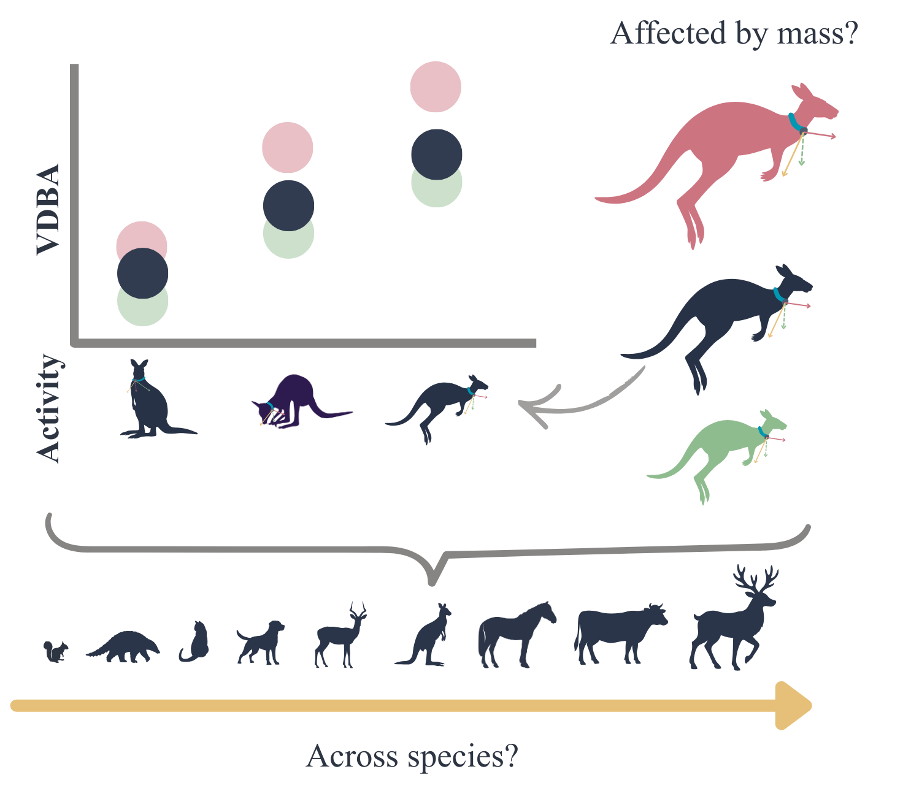

# EvaluatingVDBA

Project temporarily paused until more data can be collected. Currently too much noise, can't discern any kind of signal.

## Project Description
Bio-logging accelerometers are frequently used to estimate energetic output (metabolic cost) of animal movement as the vectorial sum of all axes (VDBA). While this metric has conclusively been found to correlate temporally with metabolic rate within individuals, how VDBA scales between individuals of differing body mass and across species of different sizes, has not been measured. In this analysis, we attempt to understand the link between animal body mass and energy output as captured by VDBA.

## Method
- 36 species datasets of raw tri-axial accelerometer data.
- Formatted to standard data structure.
- Smoothed outliers with a butterworth filter (cutoff_freq, 0.05 Hz, to remove only sudden spikes)
- Generated dynamic VDBA by removing static acceleration (either as a rolling average of 10 seconds of VDBA for continuous data or as the average of the burst)
- Separated instances into active and inactive categories such that all instances with a rolling standard deviation (measure of flatness in the rolling window) in the botton 25% were classed as inactive.
- Summarised max and mean VDBA per individual.

## Understanding the Repo
EvaluatingVDBA/  
├── AccelerometerData/  
│   └── Species1/  
│       └── raw/  
│           └── raw_files.csv  
├── Mass_of_individuals/  
│   └── data_for_that_species.csv  
├── Scripts/  
│   ├── FormattingAndProcessing/  
│   │   ├── [FormattingRawData.R](Scripts/FormattingAndProcessing/FormattingRawData.R)  
│   │   ├── [SmoothingRawData.R](Scripts/FormattingAndProcessing/SmoothingRawData.R)  
│   │   ├── [GenerateVDBA.R](Scripts/FormattingAndProcessing/GeneratingVDBA.R)  
│   │   └── script6.R  
│   ├── [Main.R](Scripts/Main.R)  
│   ├── [GeneralFunctions.R](Scripts/GeneralFunctions.R)  
│   ├── [DatasetCharacteristics.R](Scripts/DatasetCharacteristics.R)  
│   └── [ResultsMarkdown.Rmd](Scripts/ResultsMarkdown.Rmd)  
└── Output/  
    └── Plots and summary tables...  

## Acknowledgements
Project was conceptualised and lead by Chris Clemente. Data collected from various publically available sources as well as unpublished data personally provided by Jordan Di Cicco, Jasmin Annett, Josh Gaschk, Chris Clemente, and Gabby Sparkes. Analysis conducted by Oakleigh Wilson (me). Conceptual assistance from Pasha van Bijlert.

