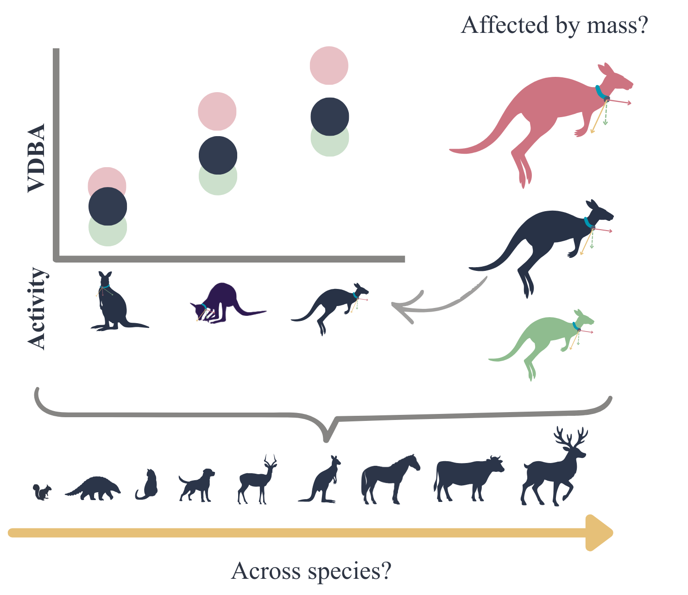

# EvaluatingVDBA

## Project Description
Bio-logging accelerometers are frequently used to estimate energetic output (metabolic cost) of animal movement as the vectorial sum of all axes (VDBA). While VDBA has conclusively been found to correlate temporally with metabolic rate within individuals, how VDBA scales between individuals of differing body mass and across species of different sizes, has not been measured. In this analysis, we attempt to understand the link between animal body mass and acceleration output as captured by VDBA. We contrast this with acceleration as measured from simulation and motion tracking. Only active locomotion data is analysed.

## Method
- XX species datasets of raw tri-axial accelerometer data where locomotion periods are known (either provided with labels or inferred using thresholds).
- Formatted to standard data structure.
- Generated dynamic VDBA by removing static acceleration (where static was calculated as a rolling average of 1 second)
- Separated locomotion instances
- Calculated the mean acceleration for a stride window approporiate to each species (e.g., kangaroo hop 2-3 times per second, to get 5-10 strides, use ~3 seconds)
- Summarised mean VDBA per stride window and then calculated mean and deviation for each individual
- Mass was calculculated as either an average (of the species or from the specific study where available) or per individual (where that data was available).

## Acknowledgements
Project was conceptualised by Chris Clemente. Data collected from various publically available sources as well as unpublished data personally provided by Jasmin Annett and Chris Clemente. Analysis conducted by Oakleigh Wilson (me). Conceptual assistance from Pasha van Bijlert.
